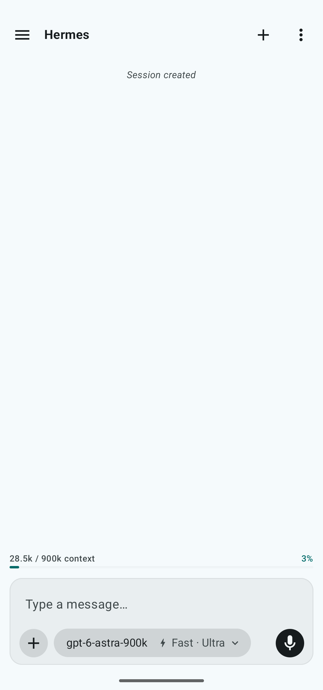
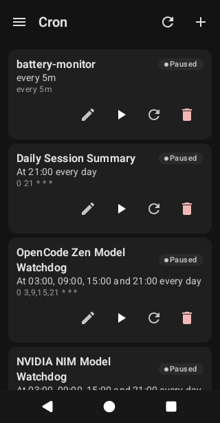
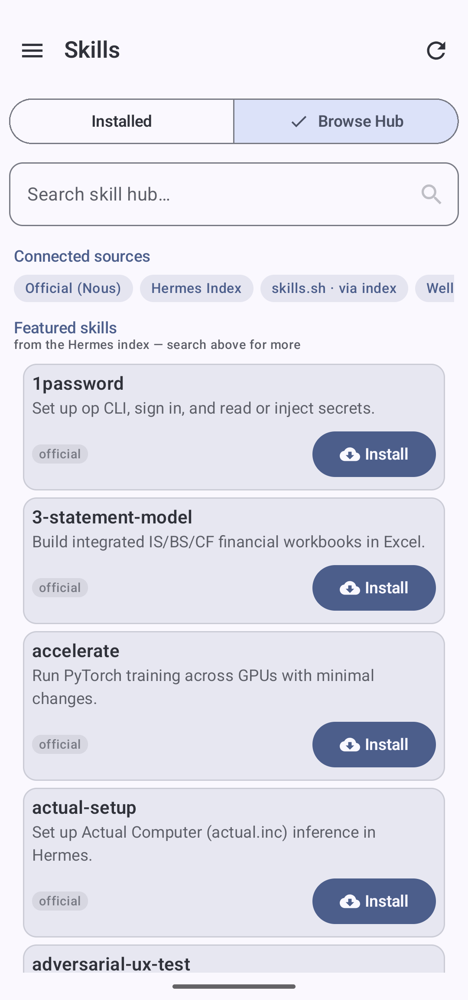
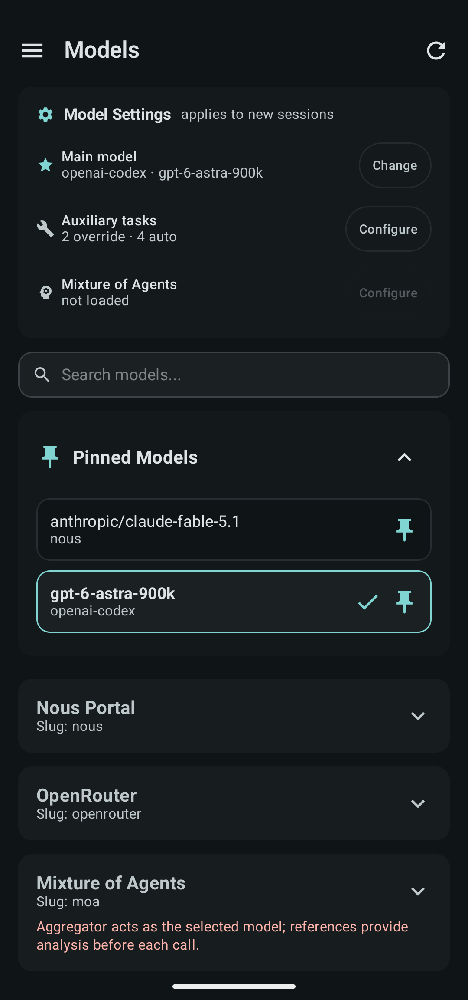
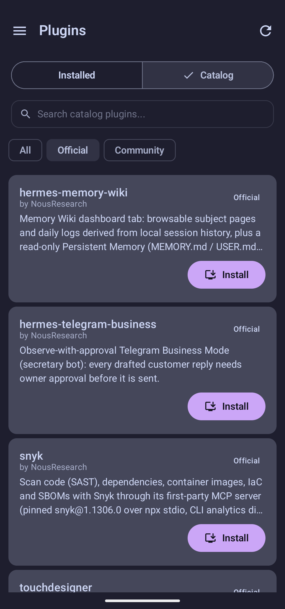
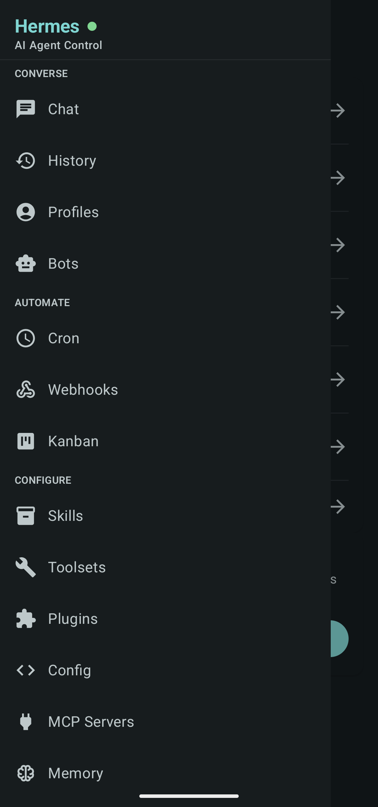
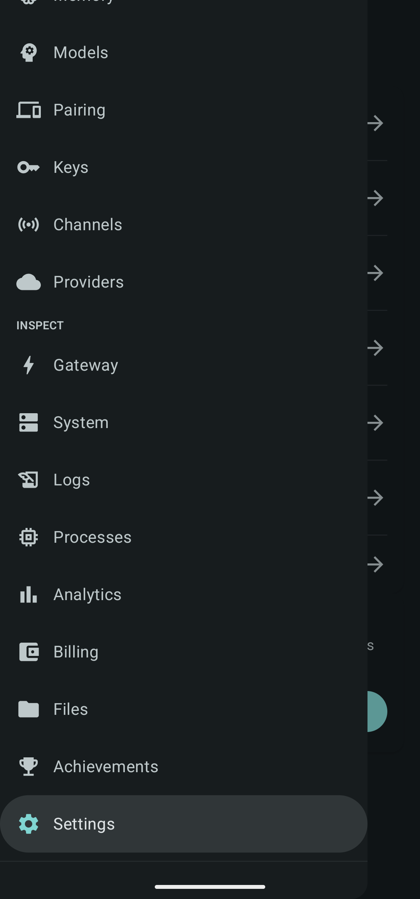

<h1 align="center">Hermes Mobile</h1>
<p align="center"><strong>Native Android companion app for your Hermes AI agent.</strong></p>

<div align="center">
  <br>
  
  
  
  
  <br><br>
</div>

<p align="center">
  <a href="https://github.com/Hy4ri/hermes-mobile/releases/latest"></a>
  
  
  
</p>

<p align="center">
  <a href="https://f-droid.org/packages/com.m57.hermescontrol/">
    
  </a>
  <a href="https://apps.obtainium.imranr.dev/redirect?r=obtainium%3A%2F%2Fadd%2Fhttps%3A%2F%2Fgithub.com%2FHy4ri%2Fhermes-mobile">
    
  </a>
</p>

---

## Overview

**Hermes Mobile** is the native Android client for [Hermes Agent](https://hermes-agent.nousresearch.com). It connects to your Hermes gateway (REST API and WebSocket TUI Gateway), giving you pocket control over your AI assistant. Plain HTTP/WS connections are intended for trusted networks only; authentication does not encrypt the transport.

---

## Support the project

If Hermes Mobile is useful to you, consider supporting its development on [Ko-fi](https://ko-fi.com/m_5_7).

---

## Screenshots

<p align="center">
  
  
  
  
</p>

<p align="center">
  
  
  
</p>

<p align="center"><em>Chat, automation, productivity, and agent configuration — from your phone.</em></p>

---

## Features

- **Real-Time Chat:** Message your agent with Room-backed local database history and inline reply notifications.
- **System Config:** Manage active profiles, installed skills, plugins, toolsets, and LLM model/provider selections.
- **Operations:** Stream and filter live logs, manage cron jobs, edit environment keys, test webhooks, and monitor processes.
- **Gateway Status:** Monitor WebSocket connection, MCP servers, messaging channels, and OAuth providers.
- **Productivity:** View and manage tasks via integrated Kanban boards, track agent milestones, and browse session history.
- **Analytics & Billing:** Usage analytics dashboard and billing/subscription management.
- **Theming:** 6 built-in color presets (Default, Monochrome, Gruvbox, Catppuccin, AMOLED, Nord) plus Material You dynamic colors on supported devices.
- **Modern UX:** Native Material 3 design with pull-to-refresh, scroll-aware TopBar, and customizable bottom navigation.

---

## Quick Start

1. Install Hermes Mobile from [F-Droid](https://f-droid.org/packages/com.m57.hermescontrol/) or download the APK from the [latest GitHub release](https://github.com/Hy4ri/hermes-mobile/releases/latest).
2. Start your Hermes dashboard on a host reachable from your phone.
3. Follow [Authentication](#authentication) below to connect. Use a trusted network for plain HTTP/WS connections.

## Build from source

### Prerequisites

- **JDK 21+** (required for Kotlin compilation and the Gradle toolchain)
- An **Android SDK** matching the compile SDK in [`app/build.gradle.kts`](app/build.gradle.kts), available through Android Studio or the **Nix** development environment. Set `ANDROID_HOME` or configure `sdk.dir` in your local `local.properties`.

### Build & Deploy

1. **Clone the repository:**
   ```bash
   git clone https://github.com/Hy4ri/hermes-mobile.git
   cd hermes-mobile
   ```
2. **Build the debug APK:**
   ```bash
   ./gradlew assembleDebug
   ```
3. **Install on your emulator/device:**
   ```bash
   adb install app/build/outputs/apk/debug/app-debug.apk
   ```

_Note: For release builds, ensure keystore environment variables (`KEYSTORE_PATH`, `KEYSTORE_PASSWORD`, `KEY_ALIAS`, `KEY_PASSWORD`) are configured, or let the GitHub Actions release workflow handle it on tag push (`v*`)._

### Nix emulator

The Nix development shell enables physical keyboard input in an existing
`hermes_dev` AVD configuration. It respects `ANDROID_AVD_HOME` and
`ANDROID_USER_HOME`, defaulting to `~/.android/avd`.

Close any running emulator, then cold boot once to apply the setting:

```bash
nix develop --command emulator -avd hermes_dev -no-snapshot-load
```

Subsequent launches can omit `-no-snapshot-load`. Create the `hermes_dev` AVD
first if it does not exist; the shell does not create one.

---

## Authentication

Once the app is installed, you need to point it at your Hermes gateway. The app auto-detects which auth mode the dashboard is using — just fill in the fields it shows.

### 1. Start the dashboard

On your host machine, start the dashboard:

```bash
hermes dashboard                          # loopback (127.0.0.1:9119) — no auth needed
hermes dashboard --host 0.0.0.0           # LAN — requires auth
```

For LAN access, configure credentials in `~/.hermes/config.yaml`:

```yaml
dashboard:
  basic_auth:
    username: admin # pick your own
    password: hermes # pick your own
```

### 2. Connect the app

Tap **Sign in** on the landing screen and enter the dashboard host and port. The app probes the dashboard and reveals the fields you need:

| Auth mode      | When                                 | What you fill                                                                                                                                                          |
| -------------- | ------------------------------------ | ---------------------------------------------------------------------------------------------------------------------------------------------------------------------- |
| **Token only** | Dashboard on same machine (loopback) | **Token** — grab from `~/.hermes/dashboard-token.txt` or `~/.hermes/.env` (`HERMES_DASHBOARD_SESSION_TOKEN`). The app can also auto-extract it from the dashboard page |
| **Basic auth** | Dashboard on LAN with password gate  | **Username** + **Password** (default `admin` / `hermes`). The app logs in, gets a session cookie, and mints a WebSocket ticket automatically                           |

Use HTTPS for remote connections. Use HTTP only on a trusted local network.

### Cloudflare Access and custom headers

1. Enter your dashboard's HTTPS URL on the login screen.
2. Tap **Custom headers**, then **Add Cloudflare headers**.
3. Enter your service token's `CF-Access-Client-Id` and `CF-Access-Client-Secret` values.
4. Tap **Save**. The app probes the dashboard again, then shows the Hermes login fields.

Your [Cloudflare Access policy](https://developers.cloudflare.com/cloudflare-one/access-controls/service-credentials/service-tokens/)
must accept the service token. These headers authenticate with Cloudflare; you still
need to complete Hermes authentication.

You can add other custom header names and values in the same editor. To edit or
remove saved headers, open **Custom headers** from login or the saved connection's
edit dialog in Settings. Values are masked and stored in encrypted preferences.
Saving an empty list removes the headers for that URL.

Headers are shared by profiles with the same server URL. They apply to probes,
login, API and media requests, and WebSocket handshakes. Each URL's scheme, host,
port, and path prefix limit where its headers are sent. Redirects outside that
scope do not receive the credentials; WebSocket redirects are not followed.
The app manages `Authorization`, `Cookie`, and transport headers itself.

### Connection profiles

Have multiple gateways? Switch between them in **Settings → Connection profiles**. Each profile stores its own host, port, and token — just tap to swap.

---

## Project Structure

```
app/src/main/java/com/m57/hermescontrol/
├── data/          # Local (Room, AuthManager), Remote (Retrofit, OkHttp), WS (WebSocket), Models
├── notification/  # Foreground service + inline reply for chat notifications
├── theme/         # Preset-based design system (6 themes), status colors, spacing, typography
├── ui/            # Compose feature screens + common components (HermesScaffold, StateViews)
├── util/          # CronExpressionFormatter, LocaleContextWrapper
└── Navigation*.kt # Navigation3 wiring, keys, screen registry, controller
```

---

## Tech Stack

- **Language:** Kotlin with KSP
- **UI & Layout:** Jetpack Compose & Material 3 / Material You
- **Navigation:** Navigation3 (Compose-first Routing)
- **Networking:** Retrofit, OkHttp, Kotlinx Serialization
- **Database:** Room with SQLCipher encryption
- **Security:** `EncryptedSharedPreferences` (AES256-GCM), DataStore
- **Theming:** Built-in presets + Material You dynamic colors; see [Themes](app/src/main/java/com/m57/hermescontrol/theme/THEMES.md)
- **Image Loading:** Coil
- **Testing:** JUnit, MockK, Turbine, Espresso, Compose UI testing
- **Formatting:** `ktlint` 1.8.0 style rules (checked automatically in CI)

Dependency versions are maintained in [`gradle/libs.versions.toml`](gradle/libs.versions.toml); build configuration and dependency scopes live in [`app/build.gradle.kts`](app/build.gradle.kts).

---

## Contributing

Contributions are welcome! Please read [CONTRIBUTING.md](CONTRIBUTING.md) for our branch workflow, code style guidelines, and PR checklist.

### Translations

Help translate Hermes Mobile into your language on [Hosted Weblate](https://hosted.weblate.org/projects/hermes-mobile/hermes-mobile/)!

For operational conventions and architecture notes, refer to [AGENTS.md](AGENTS.md). [DESIGN.md](DESIGN.md) defines visual and interaction requirements; [THEMES.md](app/src/main/java/com/m57/hermescontrol/theme/THEMES.md) explains theme implementation.

---

## License

Copyright © 2026 M57 (Hy4ri).

This project is licensed under the Apache License, Version 2.0. See the [LICENSE](LICENSE) file for details.
